# SkiaSharp.TextBlock
SkiaSharp.TextBlock adds text block and rich text layout to SkiaSharp 

## Sample uses:
NOTE: DrawTextBlock returns the SKRect that contains the text. The sample project draws a green box around this rect. See the [source](./samples) for details.

## Basic Samples
Hello World:


```C#
canvas.DrawTextBlock("Hello world!", new SKRect(0, 0, 100, 0), new Font(14), SKColors.Black);
```

FlowDirection.RightToLeft:


```C#
var text = new TextBlock(new Font(14), SKColors.Black, "Hello world!");
canvas.DrawTextBlock(text, new SKRect(0, 0, 100, 0), null, FlowDirection.RightToLeft);
```

Word Wrap:

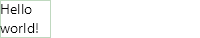

```C#
var text = new TextBlock(new Font(14), SKColors.Black, "Hello world!");
return canvas.DrawTextBlock(text, new SKRect(0, 0, 50, 0));
```

LineBreakMode.Center:


```C#
var text = new TextBlock(new Font(14), SKColors.Black, "Hello world!", LineBreakMode.Center);
return canvas.DrawTextBlock(text, new SKRect(0, 0, 50, 0));
```

LineBreakMode.MiddleTruncation:


```C#
var text = new TextBlock(new Font(14), SKColors.Black, "Hello world!", LineBreakMode.MiddleTruncation);
return canvas.DrawTextBlock(text, new SKRect(0, 0, 50, 0));
```

### Word Wrap
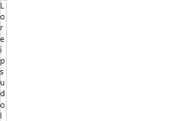
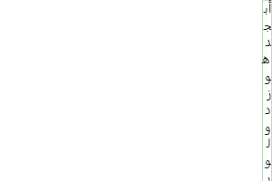

## Basic Samples 2
Word Wrap - Tight:


```C#
var text = new TextBlock(new Font(14), SKColors.Black, "Hello world!");
return canvas.DrawTextBlock(text, new SKRect(0, 0, 20, 0));
```

Courier New:

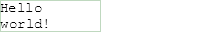

```C#
var text = new TextBlock(new Font("Courier New", 14), SKColors.Black, "Hello world!");
return canvas.DrawTextBlock(text, new SKRect(0, 0, 100, 0));
```

Color and Size:


```C#
var text = new TextBlock(new Font(20), SKColors.Red, "Hello world!");
return canvas.DrawTextBlock(text, new SKRect(0, 0, 100, 0)); 
```

New line:

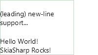

```C#
var text = new TextBlock(new Font(14), SKColors.Black, @"
(leading) new- line support...

Hello World!
SkiaSharp Rocks!");
return canvas.DrawTextBlock(text, new SKRect(0, 0, 150, 0));
```

New Line - Trailing:

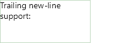

```C#
var text = new TextBlock(new Font(14), SKColors.Black, @"Trailing new- line support:

");
return canvas.DrawTextBlock(text, new SKRect(0, 0, 150, 0));
```

## Typeface Detection
Non-latin:


```C#
var text = new TextBlock(new Font(14), SKColors.Black, "年");
return canvas.DrawTextBlock(text, new SKRect(0, 0, 100, 0));
```

Cyrillic:

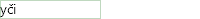

```C#
var text = new TextBlock(new Font(14), SKColors.Black, "yči");
return canvas.DrawTextBlock(text, new SKRect(0, 0, 100, 0));
```

Symbols:


```C#
var text = new TextBlock(new Font(14), SKColors.Black, "↺");
return canvas.DrawTextBlock(text, new SKRect(0, 0, 100, 0));
```

Unicode:


```C#
var text = new TextBlock(new Font(14), SKColors.Black, "🌐🍪🍕🚀");
return canvas.DrawTextBlock(text, new SKRect(0, 0, 100, 0));
```

Rtl Support:


```C#
var text = new TextBlock(new Font(14), SKColors.Black, "مرحبا بالعالم");
return canvas.DrawTextBlock(text, new SKRect(0, 0, 100, 0), null, FlowDirection.RightToLeft);
```

Multi glyph:

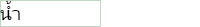

```C#
var text = new TextBlock(new Font(20), SKColors.Black, "น้ำ");
return canvas.DrawTextBlock(text, new SKRect(0, 0, 100, 0));
```

Rtl Word Wrap:


```C#
var text = new TextBlock(new Font(14), SKColors.Black, "مرحبا بالعالم");
return canvas.DrawTextBlock(text, new SKRect(50, 0, 100, 0), null, FlowDirection.RightToLeft);
```

## Rich Text
Shorter:


```C#
var text = new RichTextBlock()
{
    Spans =
    {
        new TextBlock(new Font(10), SKColors.Black, "Hello "),
        new TextBlock(new Font(20, true), SKColors.Black, "world! (bold)"),
        new TextBlock(new Font(16), SKColors.Green, "SkiaSharp Rocks!"),
    }
};
return canvas.DrawRichTextBlock(text, new SKRect(0, 0, 200, 0));

```

Longer:

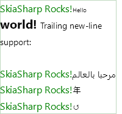

```C#
var text = new RichTextBlock()
{
    Spans =
    {
        new TextBlock(new Font(16), SKColors.Green, "SkiaSharp Rocks!"),
        new TextBlock(new Font(10), SKColors.Black, "Hello "),
        new TextBlock(new Font(20, true), SKColors.Black, "world! "),
        new TextBlock(new Font(14), SKColors.Black, @"Trailing new-line support:

"),
        new TextBlock(new Font(16), SKColors.Green, "SkiaSharp Rocks!"),
        new TextBlock(new Font(14), SKColors.Black, "مرحبا بالعالم"),
        new TextBlock(new Font(16), SKColors.Green, "SkiaSharp Rocks!"),
        new TextBlock(new Font(14), SKColors.Black, "年"),
        new TextBlock(new Font(16), SKColors.Green, "SkiaSharp Rocks!"),
        new TextBlock(new Font(14), SKColors.Black, "↺"),
    }
};
return canvas.DrawRichTextBlock(text, new SKRect(0, 0, 200, 0));
```

## Lorum ipsum
default line spacing:

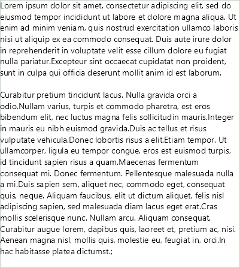

1.5x line spacing:

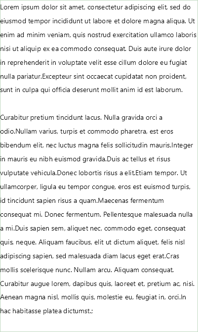

