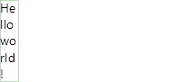
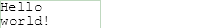
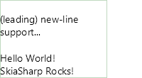
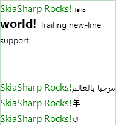

# SkiaSharp.TextBlock
SkiaSharp.TextBlock adds text block and rich text layout to SkiaSharp 

## Sample uses:
NOTE: DrawTextBlock returns the SKRect that contains the text. The sample project draws a green box around this rect. See the [source](./samples) for details.

## Basic Samples
### Hello World:

```C#
canvas.DrawTextBlock("Hello world!", new SKRect(0, 0, 100, 0), new FLFont(14), SKColors.Black);
```

### FlowDirection.RightToLeft:

```C#
var text = new Text(new FLFont(14), SKColors.Black, "Hello world!");
canvas.DrawTextBlock(text, new SKRect(0, 0, 100, 0), null, FlowDirection.RightToLeft);
```

### Word Wrap:

```C#
var text = new Text(new FLFont(14), SKColors.Black, "Hello world!");
return canvas.DrawTextBlock(text, new SKRect(0, 0, 50, 0));
```

### LineBreakMode.Center:

```C#
var text = new Text(new FLFont(14), SKColors.Black, "Hello world!", LineBreakMode.Center);
return canvas.DrawTextBlock(text, new SKRect(0, 0, 50, 0));
```

### LineBreakMode.MiddleTruncation:

```C#
var text = new Text(new FLFont(14), SKColors.Black, "Hello world!", LineBreakMode.MiddleTruncation);
return canvas.DrawTextBlock(text, new SKRect(0, 0, 50, 0));
```

### Word Wrap


## Basic Samples 2
### Word Wrap - Tight:

```C#
var text = new Text(new FLFont(14), SKColors.Black, "Hello world!");
return canvas.DrawTextBlock(text, new SKRect(0, 0, 20, 0));
```

### Courier New:

```C#
var text = new Text(new FLFont("Courier New", 14), SKColors.Black, "Hello world!");
return canvas.DrawTextBlock(text, new SKRect(0, 0, 100, 0));
```

### Color and Size:

```C#
var text = new Text(new FLFont(20), SKColors.Red, "Hello world!");
return canvas.DrawTextBlock(text, new SKRect(0, 0, 100, 0)); 
```

### New line:

```C#
var text = new Text(new FLFont(14), SKColors.Black, @"
(leading) new- line support...

Hello World!
SkiaSharp Rocks!");
return canvas.DrawTextBlock(text, new SKRect(0, 0, 150, 0));
```

### New Line - Trailing:

```C#
var text = new Text(new FLFont(14), SKColors.Black, @"Trailing new- line support:

");
return canvas.DrawTextBlock(text, new SKRect(0, 0, 150, 0));
```

## Typeface Detection
### Non-latin:

```C#
var text = new Text(new FLFont(14), SKColors.Black, "年");
return canvas.DrawTextBlock(text, new SKRect(0, 0, 100, 0));
```

### Symbols:

```C#
var text = new Text(new FLFont(14), SKColors.Black, "↺");
return canvas.DrawTextBlock(text, new SKRect(0, 0, 100, 0));
```

### Unicode:

```C#
var text = new Text(new FLFont(14), SKColors.Black, "🌐🍪🍕🚀");
return canvas.DrawTextBlock(text, new SKRect(0, 0, 100, 0));
```

### Rtl Support:

```C#
var text = new Text(new FLFont(14), SKColors.Black, "مرحبا بالعالم");
return canvas.DrawTextBlock(text, new SKRect(0, 0, 100, 0), null, FlowDirection.RightToLeft);
```

### Rtl Word Wrap:

```C#
var text = new Text(new FLFont(14), SKColors.Black, "مرحبا بالعالم");
return canvas.DrawTextBlock(text, new SKRect(50, 0, 100, 0), null, FlowDirection.RightToLeft);
```

## Rich Text
### Shorter:

```C#
var text = new RichText()
{
    Spans =
    {
        new Text(new FLFont(10), SKColors.Black, "Hello "),
        new Text(new FLFont(20, true), SKColors.Black, "world! "),
        new Text(new FLFont(16), SKColors.Green, "SkiaSharp Rocks!"),
    }
};
return canvas.DrawRichTextBlock(text, new SKRect(0, 0, 200, 0));

```

### Longer:

```C#
var text = new RichText()
{
    Spans =
    {
        new Text(new FLFont(16), SKColors.Green, "SkiaSharp Rocks!"),
        new Text(new FLFont(10), SKColors.Black, "Hello "),
        new Text(new FLFont(20, true), SKColors.Black, "world! "),
        new Text(new FLFont(14), SKColors.Black, @"Trailing new-line support:

"),
        new Text(new FLFont(16), SKColors.Green, "SkiaSharp Rocks!"),
        new Text(new FLFont(14), SKColors.Black, "مرحبا بالعالم"),
        new Text(new FLFont(16), SKColors.Green, "SkiaSharp Rocks!"),
        new Text(new FLFont(14), SKColors.Black, "年"),
        new Text(new FLFont(16), SKColors.Green, "SkiaSharp Rocks!"),
        new Text(new FLFont(14), SKColors.Black, "↺"),
    }
};
return canvas.DrawRichTextBlock(text, new SKRect(0, 0, 200, 0));
```

## Lorum ipsum

